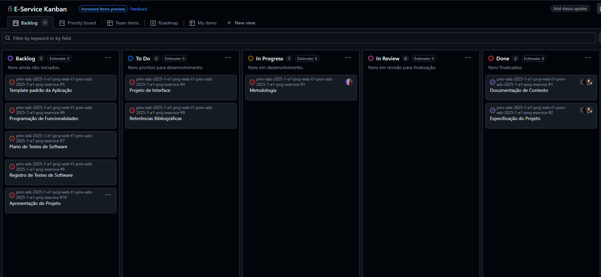
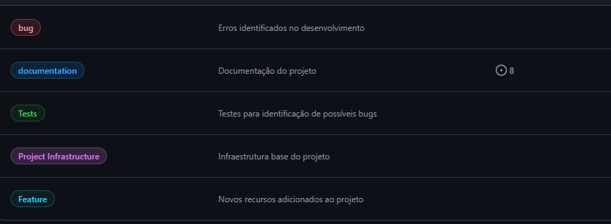

# Metodologia

Esta seção descreve a organização da equipe para a execução das tarefas do projeto e as ferramentas utilizadas para a manutenção dos códigos e demais artefatos.

## Gerenciamento de Projeto
A metodologia ágil escolhida para o desenvolvimento deste projeto foi o SCRUM, pois como citam Amaral, Fleury e Isoni (2019, p. 68), seus benefícios são a

“visão clara dos resultados a entregar; ritmo e disciplina necessários à execução; definição de papéis e responsabilidades dos integrantes do projeto (Scrum Owner, Scrum Master e Team); empoderamento dos membros da equipe de projetos para atingir o desafio; conhecimento distribuído e compartilhado de forma colaborativa; ambiência favorável para crítica às ideias e não às pessoas.”

### Divisão de Papéis

A equipe utiliza o Scrum como base para definição do processo de desenvolvimento.

- Scrum Master: Djulio Ansderson Psnsera.
- Product Owner: Gabriel Cazzuni Roani.
- Equipe de Desenvolvimento: Djulio Anderson Pansera, Fabiano Rocha Sales, Gabriel Cazzuni Roani, João Pedro Marchiori Lima, Lucca Rodrigues de Souza, Poliana dos Santos Maia.
- Equipe de Design: Fabiano Rocha Sales, João Pedro Marchiori Lima, Poliana dos Santos Maia, Lucca Rodrigues de Souza.

### Processo

A ferramenta escolhida para a organização das tarefas do projeto foi o GitHub, estruturado com as seguintes separações:
- Backlog: Esta lista recebe as tarefas a serem trabalhadas e representa o Product Backlog. Todas as atividades identificadas no decorrer do projeto também devem ser incorporadas a esta lista. 
- To Do: Esta lista representa o Sprint Backlog. Este é o Sprint atual com tarefas prontas para serem iniciadas. 
- In Progress: Esta lista recebe as tarefas iniciadas e dado inicio ao desenvolvimento.
- In Review: Esta lista representa as tarefas já desenvolvidas, porem sendo revisadas e ajustadas antes da finalização.
- Done: Nesta lista são colocadas as tarefas que passaram pelos testes e controle de qualidade e estão prontos para ser entregues ao usuário. Não há mais edições ou revisões necessárias, ele está agendado e pronto para a ação.

Para acessar o kanban do grupo realizado no GitHub acesse o [link](https://github.com/orgs/ICEI-PUC-Minas-PMV-ADS/projects/1980).
Representação atual abaixo:
<figure> 
  Figura 1 - Tela do kanban do grupo</figcaption>
</figure> 

### Etiquetas

As tarefas são, ainda, etiquetadas em função da natureza da atividade e seguem o seguinte esquema de cores/categorias:

<ul>
  <li>Erro no código (Bug)</li>
  <li>Documentação (Documentation)</li>
  <li>Testes (Tests)</li>
  <li>Infraestrutura do Projetos (Project Infrastructure)</li>
  <li>Novas funcionalidades (Feature)</li>
</ul>

<figure> 
  Figura 2 - Tela com as etiquetas e esquema de cores do grupo</figcaption>
</figure> 
  
### Ferramentas
As ferramentas empregadas no projeto foram:
- Editor de código (Preferência do desenvolvedor)
-Ferramenta de comunicação (Discord)
-Ferramenta de prototipo de tela (Figma, Obsidian)

Os artefatos do projeto são desenvolvidos a partir de diversas plataformas e a relação dos ambientes com seu respectivo propósito é apresentada na tabela que se segue.

| AMBIENTE                            | PLATAFORMA                               | LINK DE ACESSO                                                                                                                                                           |
|-------------------------------------|------------------------------------      |--------------------------------------------------------------------------------------------------------------------------------------------------------------------------|
| Repositório de código fonte         | GitHub                                   | https://github.com/ICEI-PUC-Minas-PMV-ADS/pmv-ads-2025-1-e1-proj-web-t1-pmv-ads-2025-1-e1-proj-eservice                                                                  |
| Documentos do projeto               | GitHub                                   | https://github.com/ICEI-PUC-Minas-PMV-ADS/pmv-ads-2025-1-e1-proj-web-t1-pmv-ads-2025-1-e1-proj-eservice/blob/main/documentos/01-Documenta%C3%A7%C3%A3o%20de%20Contexto.md|
| Projeto de Interface                | Figma/Obsidian                           | https://github.com/ICEI-PUC-Minas-PMV-ADS/pmv-ads-2025-1-e1-proj-web-t1-pmv-ads-2025-1-e1-proj-eservice/blob/main/documentos/04-Projeto%20de%20Interface.md              |
| Gerenciamento do Projeto            | GitHub Projects                          | https://github.com/orgs/ICEI-PUC-Minas-PMV-ADS/projects/1980                                                                                                             |
| Hospedagem                          | Não definido                             | Não definido                                                                                                                                                             |

### Estratégia de Organização de Codificação 

Todos os artefatos relacionados a implementação e visualização dos conteúdos do projeto do site deverão ser inseridos na pasta [codigo-fonte](https://github.com/ICEI-PUC-Minas-PMV-ADS/pmv-ads-2025-1-e1-proj-web-t1-pmv-ads-2025-1-e1-proj-eservice/tree/main/codigo-fonte).
